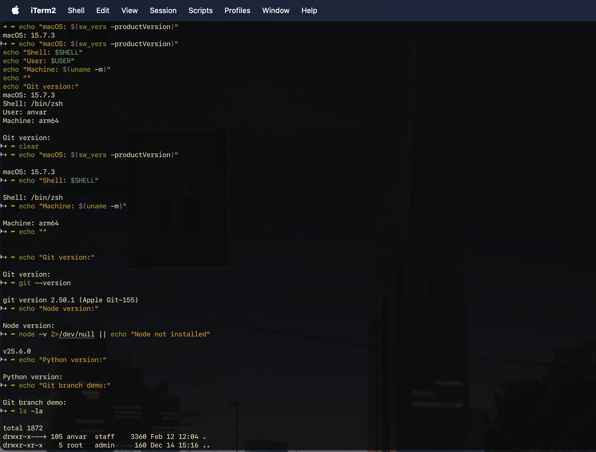

# iTerm2 + Zsh Setup

<p align="center">
  
</p>

## What's inside

- `zsh/my_iterm2.json` — iTerm2 color & font profile
- `zsh/.zshrc.example` — custom prompt with git branch

## Setup

**1. Install [Oh My Zsh](https://ohmyz.sh/)**

```bash
sh -c "$(curl -fsSL https://raw.githubusercontent.com/ohmyzsh/ohmyzsh/master/tools/install.sh)"
```

**2. Install syntax highlighting plugin**

```bash
git clone https://github.com/zsh-users/zsh-syntax-highlighting.git \
  ${ZSH_CUSTOM:-~/.oh-my-zsh/custom}/plugins/zsh-syntax-highlighting
```

Add it to plugins in your `~/.zshrc`:

```bash
plugins=(git zsh-syntax-highlighting)
```

**3. Import iTerm2 profile**

iTerm2 → Settings → Profiles → Import JSON → select `zsh/my_iterm2.json` → set as default.

**4. Apply the prompt**

```bash
cat zsh/.zshrc.example >> ~/.zshrc
source ~/.zshrc
```

Done! 🎉
